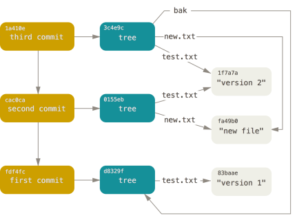
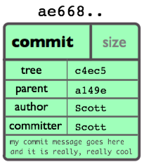
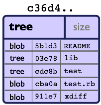
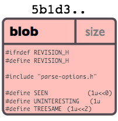
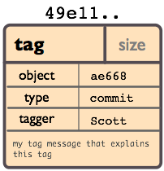

#Git Tutorial and Workshop

Software and Electrical Engineering Klub (SEEK)
-----------------------------------------------

Fall 2015

---

What is git?
------------

**Distributed Version Control System**

- Everything is stored locally - cloning a repository downloads the entire history

- A cryptographic hash identifies the current state of the repository, including the history leading up to

- A wide variety of "git remotes" can be used for code collaboration and sharing (Github, Bitbucket, your own computer, etc...)

---

Inside git
----------

Git uses 4 different types of objects:

1. commits
2. trees
3. blobs
4. tags

---

Commit Objects
--------------

- Describe the current state of the repository and its history

- References parent commit and root tree object

---

Tree Objects
------------

- Work like directories

- Reference blob objects or other tree objects

---

Blob Objects
------------

- The files of the repository (.c, .cpp, .html, .js, etc...)

---

Tag Objects
-----------

- Act as "milestones" along the hash chain of commits

- Could be used to indicate a stable release of a program

- Can be cryptographically signed with PGP/GPG to ensure security of repository

---

Putting it together
-------------------

- All git data is stored in the hidden `.git` directory

- The git commands read and write to that directory

- `git pull` will update objects in `.git/objects` based on the state of the remote repository

- `git push` will update the remote repository based on the local objects in `.git/objects`

- Object exchange can take place over various realtime protocols (*git://*, *http://*, *https://*, *ssh*, etc...)

- Can also use "sneakernets" git-bundle (email, usb-drive. etc...)

---

Setting up git
--------------

1. Git needs a username and email for commit logging purposes.
2. Does not need to be real, just a placeholder if you would like.

	`git config --global user.email "you@example.com"`

	`git config --global user.name "Your Name"`

---

Example #1 (managing a simple project with one developer)
---------------------------------------------------------

1. Create the directory for the project:	`mkdir myproject`

2. Switch in the directory:			 `cd myproject`

3. Initialize the git repository:		`git init`

4. Copy a file (hello_world.py) into the directory

5. Add that file to staging:		 `git add hello_world.py`

6. Commit these changes:		`git commit -m "Commit description here"`

7. View the history of the repository:		 `git log`

	
---

Example #2 (sharing a project with Github)
------------------------------------------

1. Login or create a Github account

2. Use the Github web interface to create a new repository

3. Clone the repository to the local computer
	
	`git clone https://github.com/UserName/project-name.git`

4. Copy your files to the working directory

5. Add these files to the staging area

	`git add file1.py file2.c`

6. Commit these files to git

	`git commit -m "Adding files to the project"`

7. Push these changes to Github

	`git push`

---

Example #3 (using branches for experimental features)
-----------------------------------------------------

1. This example assumes you have completed Example #1

2. Create a new branch:	`git branch NEW_BRANCH_NAME`

3. Switch into the new branch:	`git checkout NEW_BRANCH_NAME`

4. Make modifications safely without affecting the master branch

5. Running `git commit` will commit these modifications to the experimental branch

6. Running `git checkout master` will return to the master branch

7. Running `git merge NEW_BRANCH_NAME` will bring the experimental changes to the master branch

---

Example #4 (using Github to host a static website)
--------------------------------------------------

1. Login to Github and create a new repository *username.github.io* where *username* is your username on Github.

2. Clone the repository and add the static web files (eg. index.html)

3. Push changes to Github

	`git push`

4. Your webpage will be viewable at https://username.github.io

---

Example #5 (using Github to host a static project webpage)
----------------------------------------------------------

1. Create a branch in your repository named `gh-pages`

2. Add the static web files (eg. index.html)

3. Push the new branch to Github

	`git push -u origin gh-pages`	

4. Your webpage will be viewable at https://username.github.io/repository

---

More about git online
---------------------

- https://git-scm.com
- https://pages.github.com
- https://try.github.io

---

Credits
-------

Images from:

- http://schacon.github.io/gitbook

- https://git-scm.com/book/

Presentation created with remark.js

	- https://github.com/gnab/remark
