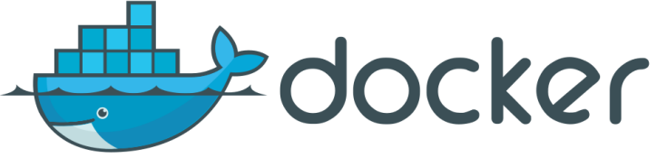
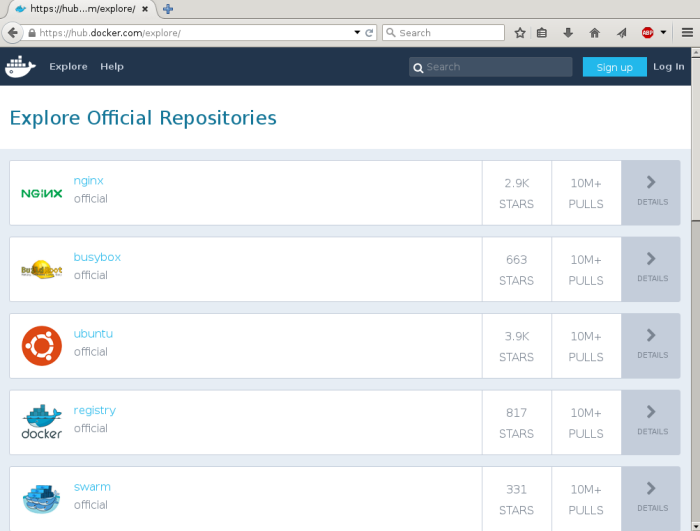
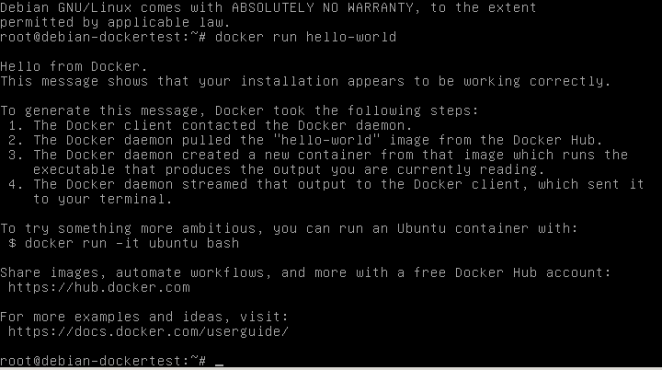
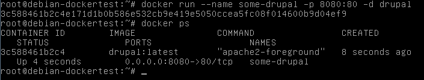
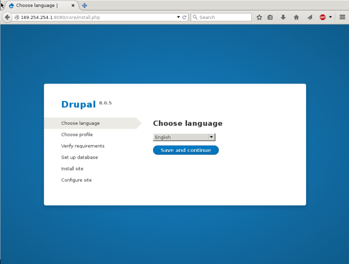
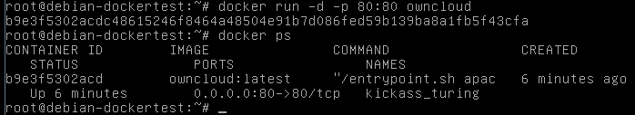
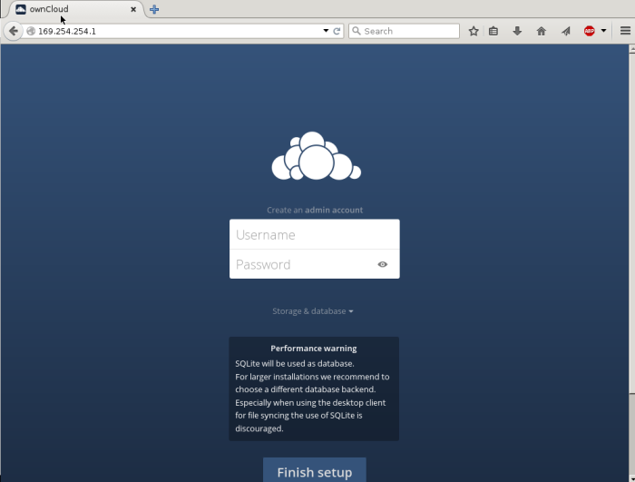
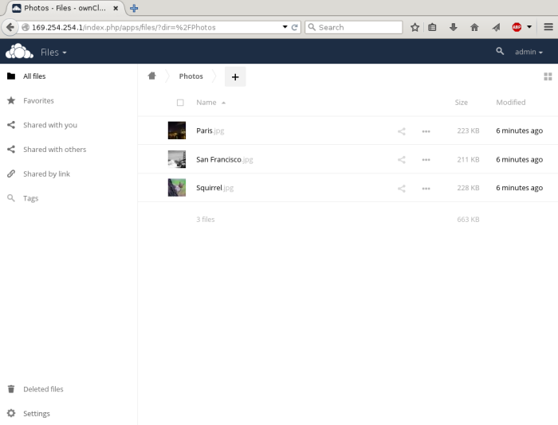
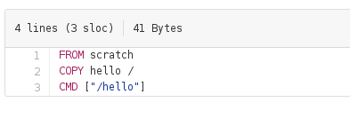

#Docker Tutorial and Workshop



Software and Electrical Engineering Klub (SEEK)
-----------------------------------------------

Winter 2016

---

What is Docker?
---------------

- *Docker is an open-source project that automates the deployment of applications inside software containers
by providing an additional layer of abstraction and automation of operating-system-level virtualization on Linux.
Docker uses the resource isolation features of the Linux kernel ... to allow independent "containers" to run within
a single Linux instance, avoiding the overhead of starting and maintaining virtual machines* - **Wikipedia**

- *Docker is a tool that can package an application and its dependencies in a virtual container that can run on any Linux
server. This helps enable flexibility and portability on where the application can run, whether on premises, public cloud,
private cloud, bare metal, etc* - **451 Research**

---

Docker Images Repository
------------------------

- Docker has a repository of thousands of free Docker images

- They are downloaded with the command `docker pull`

- Similar to Python's `pip install PACKAGENAME`

- or to node.js `npm install PACKAGENAME`

- Browse the repository at [https://hub.docker.com/explore/](https://hub.docker.com/explore/)

---




---

Getting Docker
--------------

- Docker is included in the Debian *jessie-backports* *main* repository.
	- To install become root and run `nano /etc/apt/sources.list`.
	- Then add the line `http://http.debian.net/debian jessie-backports main`
	- Run `apt-get update`
	- Run `apt-get install docker.io`

- The latest version of Docker can be installed by following the instructions at
[https://docs.docker.com/linux/step_one/](https://docs.docker.com/linux/step_one/)

- Docker also provides **Docker Engine** which allows Windows and Mac users to run Docker
containers. Installation instructions can be found at [https://docs.docker.com/engine/installation/](https://docs.docker.com/engine/installation/)


---

A Quick Demo (Hello World in Docker)
------------------------------------

- Get the image with `docker pull hello-world`

- Run the image with `docker run hello-world`



---

Docker Terminology
------------------

- Images: Ordered collection of root filesystems which has no state and never changes

- Containers: Runtime instance of a docker image (Docker image, Execution environment, instructions)

---

A more useful demo (Drupal in Docker)
-------------------------------------

- `docker pull drupal`

- `docker run --name some-drupal -p 8080:80 -d drupal`



---



---


Why Docker?
-----------

- Security (containers can be isolated from each other and host system)

- Simplicity (don't re-invent the wheel. Use pre-existing setups.)

- Portability (get a new server, change cloud providers - not a problem)

---


Web services in minutes on your own server (ownCloud in Docker)
---------------------------------------------------------------

- `docker pull owncloud`

- `docker run -d -p 80:80 owncloud`



---



---



---

Writing your own Dockerfile
---------------------------

- A Dockerfile describes how a Docker image is to be built

- Very often a Dockerfile instructs Docker to build a new image
based on a pre-existing image (which in turn is based on a pre-existing
image)

- The other commands instruct Docker on how to modify this pre-existing image (eg. copying files)

---

Writing your own Dockerfile (analyzing hello-world)
----------------------------------------------------

- This simple Dockerfile instructs Docker to copy the *hello* binary to an empty container.



---

Writing your own Dockerfile (Flask Web App project)
---------------------------------------------------

- Create your Flask App in a directory named *app*

- Create the Dockerfile

```
FROM debian:latest
MAINTAINER yourname
RUN apt-get update -y
RUN apt-get install -y python python-flask
COPY . /app
WORKDIR /app
ENTRYPOINT ["python"]
CMD ["app.py"]
```

- Build the image `docker build -t flask-sample:latest .`

- Run the image `docker run -d -p 5000:5000 flask-sample`

---

Docker in production environments
---------------------------------

- [resin.io](https://resin.io) Uses Docker for creating Raspberry Pi images for IoT devices.

- Companies using Docker include;

	- Oxford University Press
	- The New York Times
	- GE Appliances
	- UBER
	-ebay
	- yelp

---

More about Docker online
---------------------

- [https://docs.docker.com](https://docs.docker.com)
- [https://docs.docker.com/engine/reference/glossary/](https://docs.docker.com/engine/reference/glossary/)


---

Credits
-------


Presentation created with remark.js

	- https://github.com/gnab/remark
