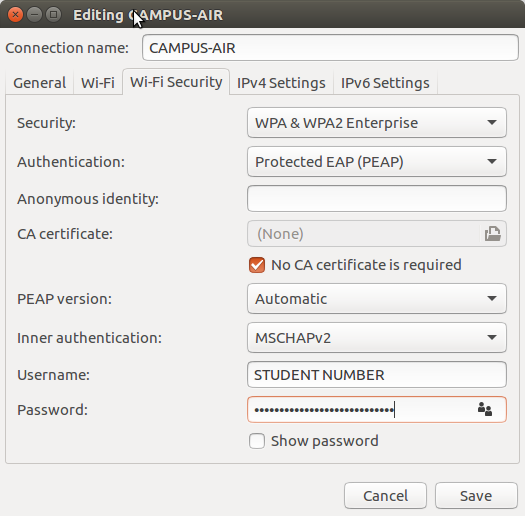
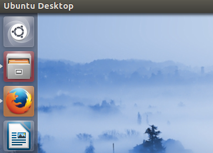
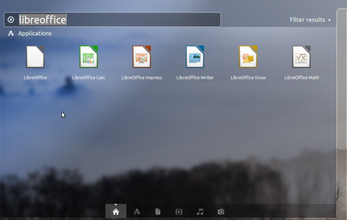
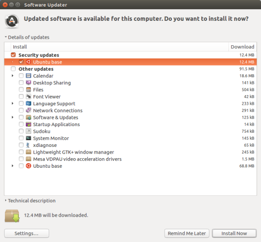
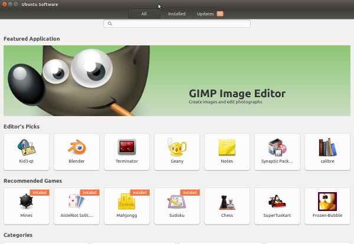
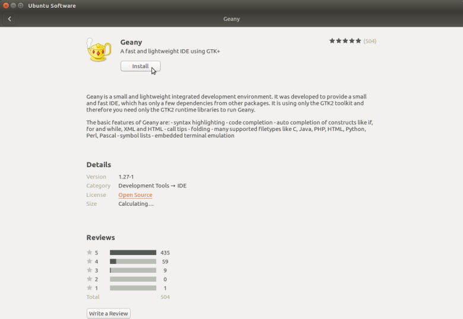
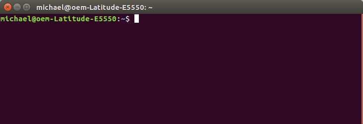

#Intro. Linux Workshop

.center[]

Software and Electrical Engineering Klub (SEEK)
-----------------------------------------------

Fall 2016

---

Fixing the IT Provided Ubuntu Image
-----------------------------------

- Graphical account setup fails

- User is left only with a guest account
	- User's files do not persist across reboots
	- No sudo permissions
		- Can't connect to WiFi
		- Can't install software packages
		
		
---


Solution
--------

- Boot Ubuntu into recovery mode

- Obtain a root shell

- Remount root as read/write
	- `mount -o remount,rw /`

- Create your user account
	- `adduser YOURNAME`

- Add your user account to `sudo` group
	- `usermod -aG sudo YOURNAME`


---

Connect to WiFi
---------------


- Click the Network Manager icon in the top right corner of the Desktop.

.center[]

- Select *CAMPUS-AIR*

- Configure Wi-Fi Security as follows
	- Security: WPA & WPA2 Enterprise
	- Authentication: Protected EAP (PEAP)
	- Anonymous identity: LEAVE BLANK
	- CA certificate: (None)
	- Check No CA Certificate is required
	- PEAP version: Automatic
	- Inner authentication: MSCHAPv2
	- Username: YOUR-STUDENT-NUMBER
	- Password: YOUR-BLACKBOARD-PASSWORD
	
---

.center[]

---

Installing to a VM
------------------

- A Linux distribution can be installed into a Virtual Machine

- Download a Virtual Machine Hypervisor (such as VirtualBox)

- Download ISO of a Linux Distribution

- Create a new Virtual Machine with a Virtual HDD (10G or greater)

- Set ISO file as CD for VM

- Start Virtual Machine

- Follow install procedure and install to virtual HDD

---

Navigating the Ubuntu Desktop
-----------------------------

- To open an application click on the Ubuntu Logo

.center[]

---

- Search for the application and click its icon

.center[]

---


Updating and Installing Software (Graphically)
----------------------------------------------

- Software should be kept up-to-date to patch known security vulnerabilities.
	- At the minimum, security updates should be installed

- Open the *Software Updater* Program

---

.center[]

---

- Software can be installed (graphically) through *Ubuntu Software*

.center[]

.center[]

---

.center[]

---


Updating and Installing Software (Commands)
-------------------------------------------
	
- The list of available software can be updated with the command `sudo apt-get update`

- To search for a package:
	- `apt-cache search PACKAGENAME`
	
- To see if a package is installed:
	- `apt-cache policy PACKAGENAME`

- A software package can be installed (or updated) with the command `sudo apt-get install PACKAGENAME`
	- `sudo apt-get install python-pygame` will install the Pygame library for Python

---

Running Linux Commands
----------------------

- Open the *Terminal* program.

- Tip: Use the TAB key for auto-complete

.center[]

---

Linux (UNIX) Commands
---------------------

- `man PROGRAM_NAME` displays the manual page for PROGRAM_NAME

- `echo STRING` prints STRING to the console

- `ls` for displaying contents of the current directory
	- `ls -l` for listing file attributes
	- `ls -al` for listing file attributes including hidden files

- `cd DIRNAME` for changing to a directory

- `pwd` (print working directory) for displaying path of current directory

- `cp SOURCE DEST` copy a file from SOURCE to DEST
	- `cp -r` copy a directory from SOURCE to DEST
	- `cp -r -v` copy a directory from SOURCE to DEST, displaying file paths being copied
	
---
	
- `mv SOURCE DEST` move a file (or rename) from SOURCE to DEST

- `rm FILENAME` deletes the file named FILENAME
	- `rm -r DIRNAME` deletes the directory named DIRNAME, and all contained files and sub-directories

- `mkdir DIRNAME` create a directory named DIRNAME

- `nano FILENAME` open the textfile FILENAME for editing in GNU Nano

---

Useful Text Processing Commands
-------------------------------

- grep: print all lines containing a string

```bash
ls | grep hello_world
```

- cut: extract substrings from a string

```bash
echo "Monday,Thursday,Friday" | cut -d ',' -f2 
#prints Thursday
```

- sed: find and replace

```bash
echo "Monday,Thursday,Friday" | sed s/Thursday/Wednesday/
#prints Monday,Wednesday,Friday
```

---

More Commands
-------------

- `sha1sum FILENAME`, `sha256sum FILENAME`, `sha512sum FILENAME`
	- Calculates the various hashes (fingerprints) of the file named FILENAME
	
- `gpg -c FILENAME`
	- Encrypts FILENAME as FILENAME.gpg

- `gpg -d FILENAME.gpg > FILENAME`
	- Decrypts FILENAME.gpg as FILENAME

---


Netcat
------

- Very useful program for communicating with other computers on the network

- `nc -l -p PORTNUMBER -s IPADDR -q 0 < INPUT > OUTPUT`
	- Listen on TCP port PORTNUMBER for incomming connection
	- Listen on interface with IP address IPADDR (find this with ifconfig)
	- Send INPUT file to client
	- Write data from client to OUTPUT file
	
- `nc IPADDR PORT -q 0 < INPUT > OUTPUT`
	- Connect to IP address IPADDR on TCP port PORT
	- Send INPUT to server
	- Write data from server to OUTPUT file


---


Writing Scripts in BASH
-----------------------

- All BASH scripts should begin with the following line
```bash
#!/bin/bash
```

- The simplest BASH script is just the list of commands you would type on the command line

- BASH also supports the features you would expect in any programming language
	- Variables
	- Conditionals (if statements)
	- Loops

- Write the BASH script in a text editor, `chmod u+x script.sh`, execute with `./script.sh`

---

BASH Variables
--------------

- A value can be assigned to a variable with the syntax: `my_variable=VALUE`
	- `x=5`
	- `y="Hello, World"`
	
- The output of a program can be sent to a variable
	- start_date=$(date)

- Variable contents are accessed with the `$variable` syntax
	- `echo "$x, $y"`

- The command line arguments are given the variables `$1`, `$2`, `$3`, etc...

---

Pipes
-----

- An incredibly useful feature of BASH is it's ability to send to output of one program to the input of another.
	- This is called piping.

- Example:

```bash

ls | grep image_

```

- The command `ls` prints the contents of the current directory

- The output of `ls` is sent to the input of `grep`.

- `grep` only prints lines which contain the text `image_`

---

I/O Redirection
---------------

- The output of a command can also be sent to a file.

```bash

date > today_date.txt

```

- The input of a command can also be read from a file.

```bash

md5sum - < file.bin

```

---

- Devices/Settings in Linux are also often listed as files under `/dev`, `/sys` or `/proc`.

- For example an Arduino connected to a Linux computer could appear as `/dev/ttyACM0`

- The following one-liner would allow any device on the network to "talk" to an Arduino.

```bash
nc -l -p 9005 -q 0 < /dev/ttyACM0 > /dev/ttyACM0
```

- Although the Serial port would probably first need to be configured

```bash
stty -F /dev/ttyACM0 cs8 115200 ignbrk -brkint -imaxbel -opost -onlcr -isig -icanon -iexten -echo -echoe -echok -echoctl -echoke noflsh -ixon -crtscts
```

---

Arithmetic
----------

- BASH supports aritmetic operations on variables

- Done through the `expr` command

```bash
x=7
y=2
z=$expr($x + $y)
echo "$x + $y = $z"
#prints 7 + 2 = 9
```

---

Conditionals
------------

- The syntax for a conditional statement in BASH is as follows:

```bash

if (( x < y ))
then
	echo "Condition was true"
else
	echo "Condition was false"
fi

```

---

Loops
-----

- The syntax for a *for* loop in BASH is as follows:

```bash

for (( x=0; x<15; x=x+1 ))
do
echo $x
done

```

- The syntax for a *while* loop in BASH is as follows:

```bash

w=10
while (( w < 20 ))
do
echo $w
w=$(expr $w + 1)
done

```

---

Useful Linux Websites
---------------------

- The Linux Documentation Project (www.tdlp.org)

- Ask Ubuntu (www.askubuntu.com)

- Unix & Linux Stack Exchange (www.unix.stackexchange.com)

- Arch Linux Wiki (https://wiki.archlinux.org)

- Digital Ocean Community Tutorials (https://www.digitalocean.com/community/tutorials)

---

# Thank you, questions? #


